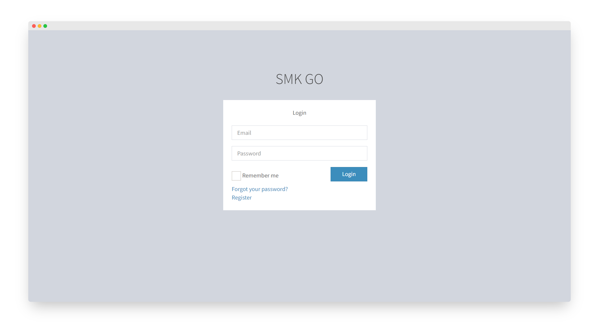
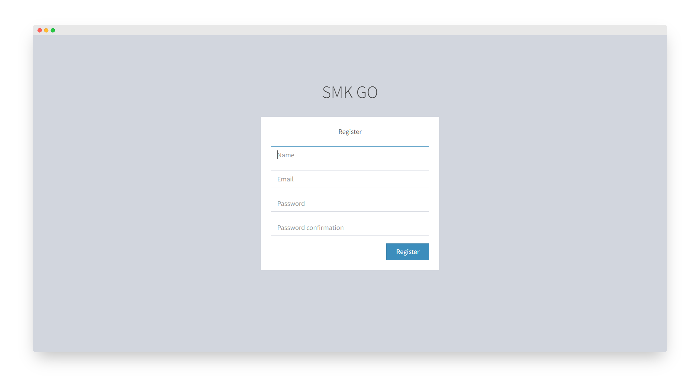
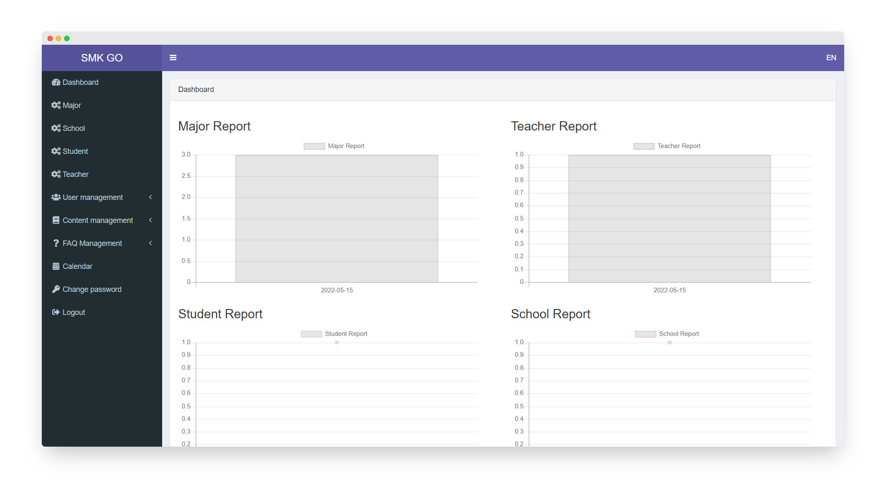
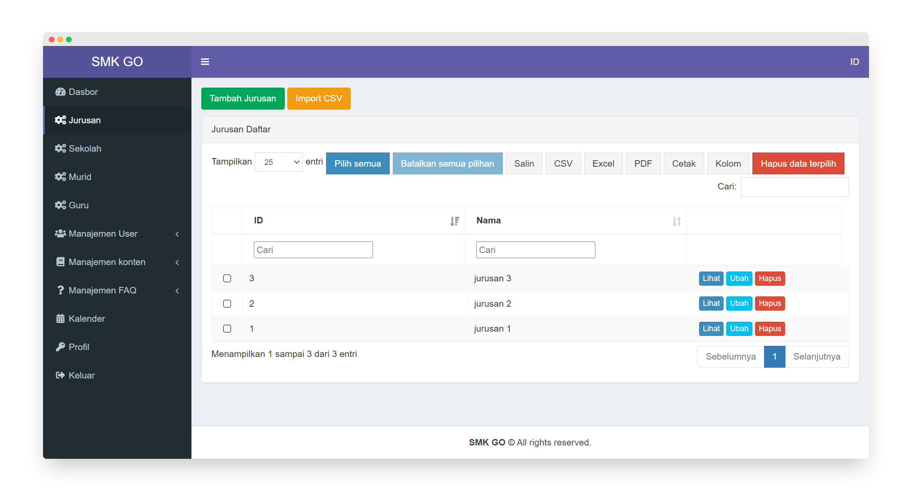
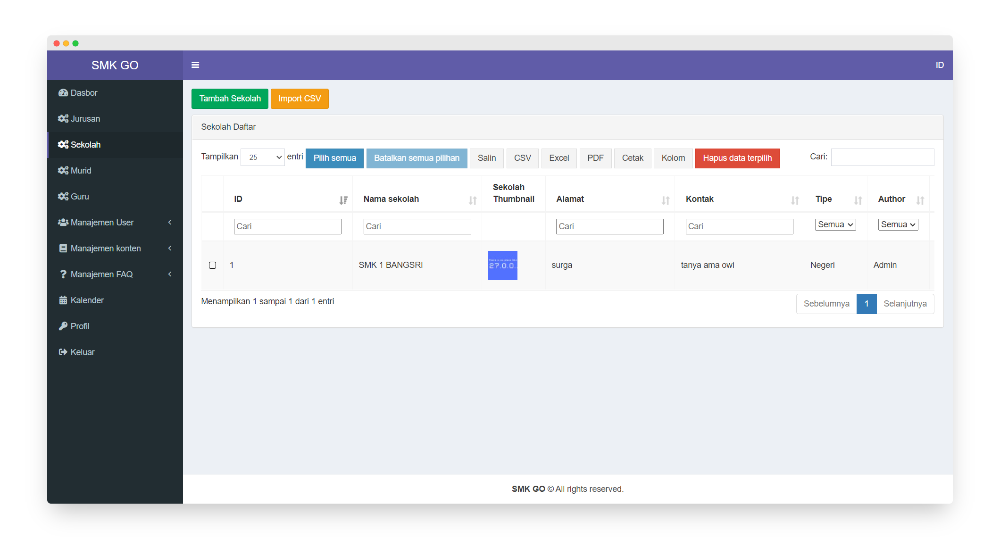

# **SMK GO**

---

## Screenshots











---

## Installation

Silahkan ikuti instruksi dibawah ini untuk menjalankan project ini :

1. Clone project ini pada komputer Anda. Pastikan sudah terinstall git.

    ```bash
    git clone https://github.com/IhsanDevs/smk_go.git
    ```

2. Buka terminal Anda pada project ini. Gunakan command :

    ```bash
    cd smk_go
    ```

3. Kemudian install semua dependency composer yang dibutuhkan. Pastikan sudah terinstall composer juga.

    ```bash
    composer install
    ```

    ```bash
    composer update
    ```

4. Setelah itu, copy paste file `.env.example` menjadi file `.env`.

5. Buka project di code editor Anda.

6. Konfigurasikan database username, database password, dan database name sesuai dengan server database Anda.

7. Karena disini menggunakan fitur [`MustVerifyEmail `](https://laravel.com/docs/9.x/verification), jadi kita harus mengkonfigurasikan email untuk mengirim link confirmation nya nanti. Untuk melakukan itu, silahkan gunakan layanan [mailtrap.io](https://mailtrap.io/). Untuk konfigurasi SMTP Email, silahkan lihat video dibawah ini:

 

8. Kembali ke terminal dan lakukan migrasi serta seeding table.

    ```bash
    php artisan migrate:fresh --seed
    ```

9. Setelah itu hubungkan path storage ke public agar file yang diupload user dapat diakses.

    ```bash
    php artisan storage:link
    ```

10. Jika sudah semua, silahkan jalankan aplikasi dengan ketik :

    ```bash
    php artisan serve
    ```

## Note

Disini tampilan project memang berbeda karena saya rombak semua dari awal. Mengingat kalian juga belum terlalu paham mengenai Laravel bahkan livewire, jadi sepertinya tidak memungkinkan untuk _push_ tugas ini dalam waktu singkat. Jadi saya buat project ini menjadi **_"sangat sederhana"_** namun terlihat kompleks. Kenapa tampilan _front-end_ yang lain tidak ada? Ya, itu memang tugas kalian untuk mendesain _front-end_ nya dan ini sangat gampang sekali. Karena untuk proses CRUD, semua sudah saya sediakan. Tinggal hubungkan ke _front-end_ yang kalian buat.

Untuk detail project ini, silahkan lihat video dibawah ini :

[](https://drive.google.com/file/d/1AEdxlbWGLlinaB4wvz84pdOrZpj9peu7/view)

## Reference

-   Dokumentasi Role and Permission : https://spatie.be/docs/laravel-permission/v5/introduction
-   Setup mailtrap.io pada Laravel : https://www.laravelcode.com/post/how-to-send-mail-using-mailtrap-in-laravel-7
-   Dokumentasi Laravel Multi Languange : https://laravel.com/docs/9.x/localization
-   Dokumentasi Laravel Relationship Table : https://laravel.com/docs/9.x/eloquent-relationships#main-content
-   Template AdminLTE 2 : https://adminlte.io/themes/AdminLTE/documentation/index.html#introduction
